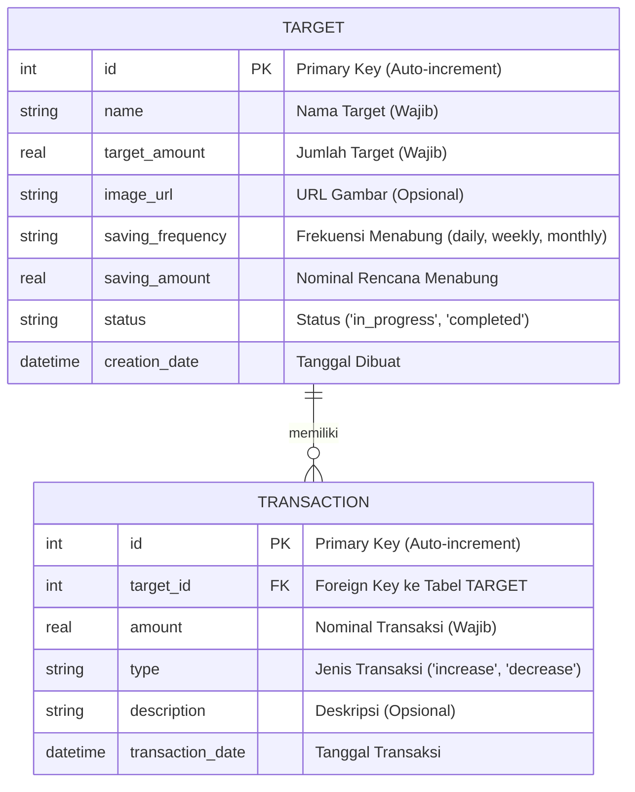

# Entity-Relationship Diagram (ERD): TargetKu

Dokumen ini mendefinisikan struktur entitas dan relasi database untuk aplikasi TargetKu. Diagram ini dibuat menggunakan sintaks Mermaid.

## Diagram

## Penjelasan Entitas dan Relasi

### 1. **TARGET**
Tabel ini menyimpan semua data utama untuk setiap target tabungan yang dibuat oleh pengguna.
- `id`: Kunci utama unik untuk setiap target.
- `name`: Nama dari target yang ingin dicapai (misal: "Laptop Baru").
- `target_amount`: Jumlah uang yang dibutuhkan untuk mencapai target.
- `image_url`: Path atau URL ke gambar yang merepresentasikan target (opsional).
- `saving_frequency` & `saving_amount`: Mendefinisikan rencana menabung pengguna (misal: menabung `50000` setiap `weekly`).
- `status`: Menandai apakah target masih "dalam proses" atau sudah "selesai".
- `creation_date`: Timestamp kapan target ini pertama kali dibuat.

### 2. **TRANSACTION**
Tabel ini menyimpan semua catatan pemasukan atau pengeluaran untuk sebuah target.
- `id`: Kunci utama unik untuk setiap transaksi.
- `target_id`: Kunci asing yang menghubungkan transaksi ini ke `TARGET` yang spesifik.
- `amount`: Jumlah uang dalam transaksi.
- `type`: Jenis transaksi, yaitu `increase` (menambah tabungan) atau `decrease` (mengambil tabungan).
- `description`: Catatan tambahan untuk transaksi (opsional).
- `transaction_date`: Timestamp kapan transaksi ini dicatat.

### 3. **Relasi (TARGET ||--o{ TRANSACTION)**
- Hubungan antara `TARGET` dan `TRANSACTION` adalah **One-to-Many**.
- Artinya, **satu** `TARGET` dapat memiliki **banyak** `TRANSACTION`.
- Ini memungkinkan kita untuk melihat seluruh riwayat tabungan untuk setiap target yang ada.
